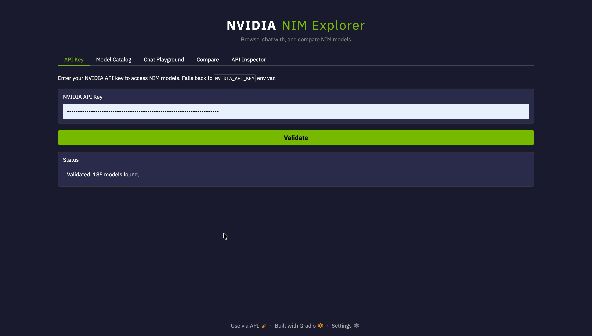
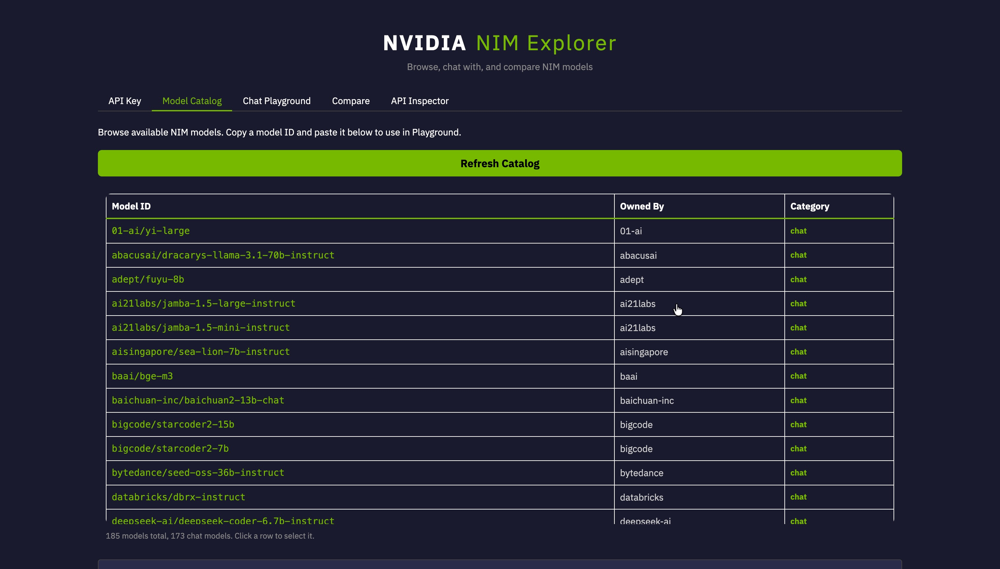
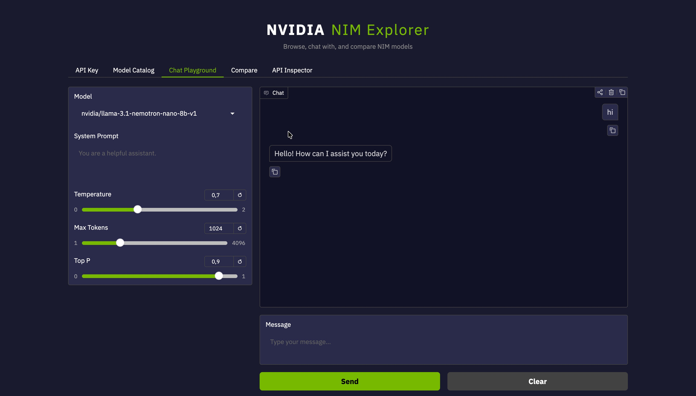
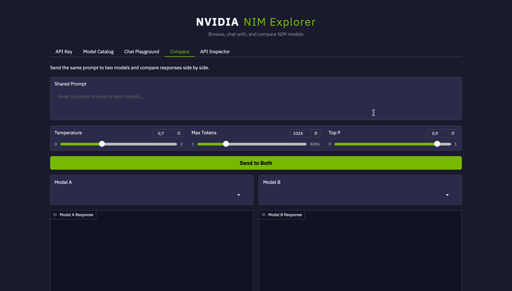
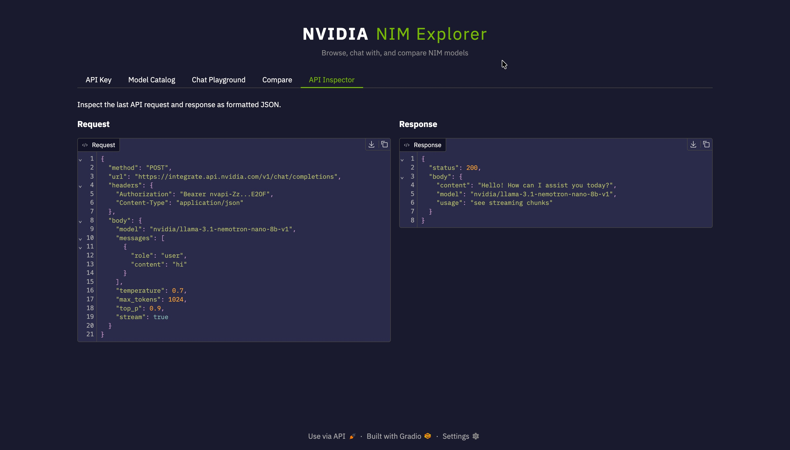

# NVIDIA NIM
NVIDIA NIM (Inference Microservices) is a set of pre-built, optimized, containerized AI inference engines designed to accelerate the deployment of generative AI models. Part of the NVIDIA AI Enterprise suite, NIM enables developers to easily deploy models on any NVIDIA-accelerated infrastructure—from local workstations to cloud and data centers—using industry-standard APIs with high performance and security.

# NVIDIA NIM Explorer

A Gradio app for browsing, chatting with, and comparing NVIDIA NIM models via the `integrate.api.nvidia.com` endpoint.

## Features

**API Key Validation** -- Enter your NVIDIA API key (or set `NVIDIA_API_KEY` env var), validate it, and see the total number of available models.



**Model Catalog** -- Browse all 185+ NIM models in a searchable table. Chat models are ranked first and highlighted in green. Embedding and other model types are listed below in grey. Click any row to select it for use in the Playground.



**Chat Playground** -- Select a model from the dropdown, configure temperature, max tokens, and top_p, set a system prompt, then chat with streaming responses.



**Compare** -- Send the same prompt to two models in parallel. Each response includes its elapsed time, making it easy to benchmark speed and quality side by side.



**API Inspector** -- View the raw JSON request and response from the last API call. The API key is automatically masked. Useful for debugging or copying payloads into your own code.



## Quick Start

```bash
cd nim-explorer
python3 app.py
```

Opens at [http://localhost:7862](http://localhost:7862).

## Dependencies

- `gradio`
- `openai`

## How It Works

The app uses the OpenAI Python client pointed at NVIDIA's NIM endpoint.

```python
from openai import OpenAI

client = OpenAI(
    base_url="https://integrate.api.nvidia.com/v1",
    api_key="nvapi-..."
)
```

All chat-capable models serve the standard `/v1/chat/completions` interface with streaming support. The model catalog is fetched from `/v1/models`. Embedding and reranking models are identified by keyword matching and excluded from the chat/compare dropdowns.
